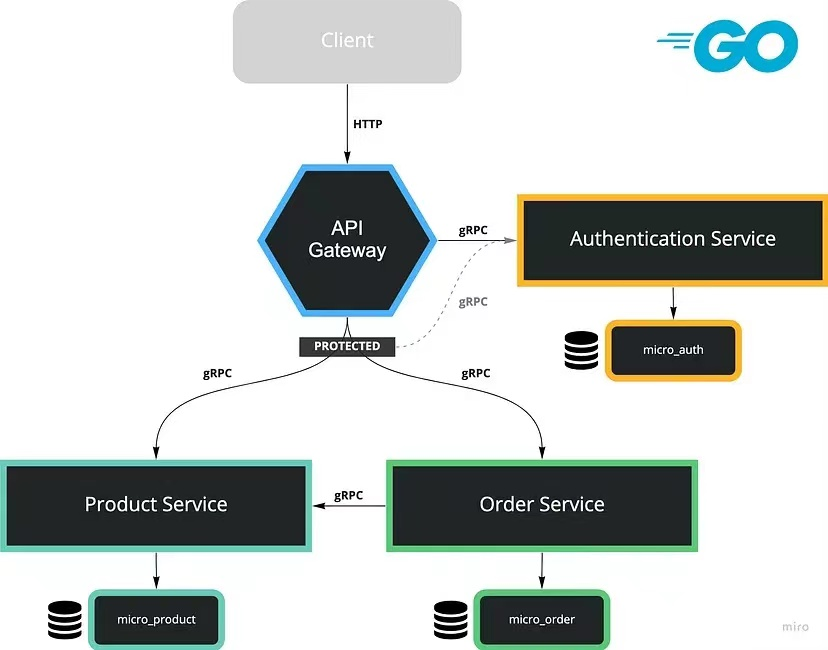

# shop，mini demo


## 架构图




```text
API 网关：处理 HTTP 请求
Auth 服务：提供注册、登录和生成 JWT 令牌
Product 服务：添加商品、扣减库存、查找商品
Order 服务：创建订单
```


## 前置准备

```text
mysql> show databases;
+--------------------+
| Database           |
+--------------------+
| auth_svc           |
| order_svc          |
| product_svc        |
+--------------------+
```

## Tips

```text
proto 文件要保持一致

```

## Todo

```text

集成 web 中间件
链路追踪
......

```